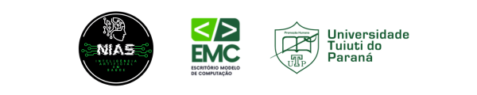

# CondyleBase

  

Este repositório contém a base de dados e o pipeline completo de processamento
utilizados na pesquisa sobre a **classificação morfológica do
côndilo mandibular (Normal e Achatado)** em imagens radiográficas.

A pesquisa foi desenvolvida no âmbito do **Núcleo de Inovação e Aplicações em Saúde (NIAS)**,
em colaboração com o **Escritório Modelo de Computação (EMC)** da
**Universidade Tuiuti do Paraná (UTP)**.

---

## Estrutura de diretórios

### A_ORIGINAL / N_ORIGINAL
Imagens radiográficas originais, sem qualquer processamento, referentes às
classes **Achatado (A)** e **Normal (N)**.

### A_PADRONIZADO / N_PADRONIZADO
Imagens após padronização geométrica e de contraste, garantindo maior
uniformidade visual para as etapas subsequentes.

### A_ROI / N_ROI
Regiões de interesse (ROI) do côndilo mandibular, extraídas automaticamente a
partir das imagens padronizadas.

### A_ROI_EXTERNO / N_ROI_EXTERNO
Imagens externas utilizadas para validação e avaliação do modelo, permitindo a
análise do desempenho em dados não utilizados no treinamento.

### PROGRAMAS
Notebooks Jupyter, utilizando o ambiente Google Colab, organizados em ordem sequencial do pipeline experimental:
1. Renomeação das imagens  
2. Padronização geométrica e de contraste  
3. Extração automática de ROIs  
4. Preparação e organização dos dados para anotação no CVAT  
5. Treinamento e avaliação do modelo com YOLOv8  

### YOLO
Arquivos de configuração, treinamento e resultados do modelo YOLOv8 empregado
na classificação morfológica do côndilo mandibular.

---

## Observações

Este repositório foi disponibilizado com **autorização institucional**, com o
objetivo de promover **transparência, reprodutibilidade e compreensão do fluxo
experimental**, permitindo que pesquisadores externos compreendam tanto a
organização dos dados quanto as etapas do pipeline de processamento.

